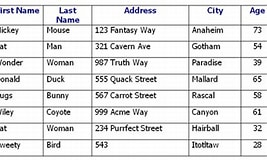

# DATABASES AND SQL LANGUAGE

## INTRODUCTION TO SQL

Introduction to Databases

What is Data ?

Data can be facts, numbers or texts. It can be bits, bytes or other forms of information

Data is structured in a specific way and stored for a particular purpose.

What is Database ?

A Database can be defined as the collection of data stored in a computer so that can be accessible, managed and update easily

Databases are often created by using formal design and modelling approaches and they are typically managed by a system called DBMS.

The data along with the DBMS and any associated applications is referred to as a Database system or Database

They are five common database types in my sql

1. Relational Database
2. NoSQL Database
3. Graph Database
4. Centralized Database
5. Distributed Database

Relational Database : A Relational Database can be defined as a collection of objects that are linked by relationships.It is structured into tables, where the rows are recorded with a unique ID in each row called the key

Ex - Microsoft SQL server, Postgre SQL, MySQL

NoSQL Databases : NoSQL databases are non-tabular databases that store data in JSON documents instead of relational tables.They are classified into several categories based on their data model such as document, key-value, wide-column, and graph databases.

NoSQL databases are designed to be flexable, scalable and capable of responding rapidly to the data management requirements of modern businesses

Ex - MongoDB, Amazon Dynamo DB and Apache HBase

Graph Database : The Graph database(GDB) is a database that uses graphical structures to describe and store data for semantic queries along with nodes, edges and attributes. An edge contains start node and end node , a types and a direction and may it also be used parent-child relationships, actions and ownership

Ex - Cambridge semantics, neo four j, mark logic

Centralized Database : A centralized database is stored, located, changed and maintained in a single location such as mainframe computer. It is frequenctly accessed via , an internet connection, such as LAN or WAN

Ex - Microsoft SQL server and MySQL, SQL lite

Distributed Database : A distributed database(DDB) is a unified collection of several linked databases that are physically dispersed in a computer network .in order to form DDBS, the files must be structured, logically interconnected and physically distributed overal several sites

Ex - Ghost Database , Amazon simple DB, Apache HBase

INTRODUCTION TO DBMS

A database management system is a software that stores and retries data for the users while taking necessary security precautions.

It also comprises a set of applications that manipulates the database

The database management system is act as an interface between the data and software that allowing third-party applications to store and retrieve data

INTRODUCTION TO RDBMS

The RDBMS is an advance version of DBMS

It is the most popular DBMS in the market

Ex - SQL server, My SQL, and Oracle

DBMS vs RDBMS

| DBMS                                                              | RDBMS                                                 |
| ----------------------------------------------------------------- | ----------------------------------------------------- |
| it stores data as a file                                          | it stores data in the form of tables                  |
| it only supports single user                                      | it supports multiple users                            |
| It storse the data which is not related to each other             | Data stored in tables are related via keys            |
| Data fetching is slower for the complex and large volumes of data | Data fetching is rapid because of relational approach |
| It doesn't supports normalization                                 | It supports normalization                             |
| It has no security                                                | It has multiple levels of security                    |
| Ex - File system, XML, MS Access and Windows Registry             | Ex - MySQL, PostgreSQL, Oracle, SQL server            |

INTRODUCTION TO MYSQL

MySQL is a relational database management system that uses SQL language to query relational databases

Features

* Ease of access - it let's you accessa ny data within relational database easily and efficiently
* Fast computational speed - it offers fast computation speed in retrieving large amounts of data efficiently
* Versatile - It also versatile in nature and work with different DBMS such as Oracle, IBM, Microsoft etc.,
* Easy to manage - it helps to manage database without performing lot of programming operations

Applications

* it is used to create database, define its structure, implement it and perform many functions
* It is also used for maintaining an already existing database
* it is powerful language that is used for entering, modifying, and extracting data from database.
* It is extensively used as client server language to connect the front-end with back-en.thus, supporting client-server architecture
* We can deploy MySQl as data control language.If we do so, it will protect our database from unauthorized access

TABLES IN MYSQL

Here table name is customer_details - In this table, we have different columns which contains the first name, last name, address, city.These are commonly known as "fields" in a databas.

In a database, each row represented as a record or tuple - We can extract any customer details by using unique value that is present in the table

We can use different SQL commands on the table to perform multiple operations such as update, insert and delete

RELATIONSHIPS IN MYSQL

A relationship is a condition that exists between two tables in a database when data from one table reflects data from the another table

Relationships in MySQL enables relational database to divide and store data in many tables while connecting to dissimilar data components it connects or relates data from various tables

Two tables can form a table at the same time where one of them is called as primary or parent table and the other one is called related or child table

VIEWS IN MYSQL

views can be defined as virtual tables in MySQL that are built by choosing fields from one or more tables that are present in the database

A view may contain database tables from single or multiple databases

Views do not contain any data or do not exists physically in the database

A view can be used to represent all the data in a table or only specific rows based on certain ceriteria

A view can also be called a collection of preset SQL queries that are used to retrieve data from database

TABLES vs VIEWS

| TABLES                                                                            | VIEWS                                                                                                             |
| --------------------------------------------------------------------------------- | ----------------------------------------------------------------------------------------------------------------- |
| They are database objects that comprises a collection of data stored in a databse | They are virtual tables in MySQL that are built by choosing field from one or more tables present in the database |
| They contain data and existed physically                                          | They do not contain data nor does not exist physically in the DB                                                  |
| They are independent data object                                                  | They depends on tables                                                                                            |
|                                                                                   |                                                                                                                   |
|                                                                                   |                                                                                                                   |
